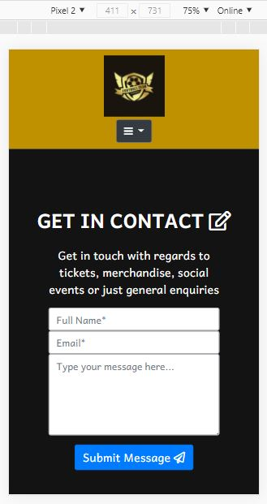

# Project Purpose:
## My Goal
There are so many local football clubs that have websites that are poorly done. Their content is not responsive, so it looks good on desktop but looks horrible on mobile. This always annoys me because whenever I want to find some information about my local football team it is always a struggle and a pain. The text is not aligned properly on the page. The style looks like its from the 1990's, it just does not feel modern. 

I want to build a sleek website, that looks modern and is able to adapt to modern requirements such as being responsive for desktop and mobile. I want the website to have all the most relevant information and to make the supporter's life easier. Most football sites do not include navigation links to fixtures, I want to add these links so that supporters can easily see where games are being played, without them having to copy and paste the location into a new window.

Often when looking on local teams websites they have a lot of wasted space or the content does not fit into the layout properly. I want to try and maximise space without putting to much stuff onto the screen as many websites can put to much content onto a page and the page can become confusing and the visitor can be put off visiting the site due to the poor layout.

[Local teams website](https://www.dunstabletownfc.co.uk/)

[My live website](https://kylelawrencedev.github.io/futsal-city/)

## Target Audience
The General Public, club supporters and appealing to Corporate Sponsors.
## Relevant Content
Show past and future fixtures to give supporters an idea of how the team has been doing.
Contact form, so supporters can email club about purchasing tickets and/or any other questions they may have. Also easier for potential corporate sponsors to get into contact with the club about potential sponsorship deals.
Club news on home page for supporters to keep up-to-date with anything happening at the club.
Club Social Events to increase supporter engagement at the club.
Mini-gallery on home page helps add colour to the page as well as show off the club kit and players. Showing club kit will increase the chances of site visitors buying the kit, thus increasing cash flow.
## Supporter Needs
Club information with regard to fixtures and results. Keeping fixtures and results up to date means supporters know they can rely on the club keeping them up-to-date with how the club is doing. Lowering the posibility of supporters using other sites for that information, meaning supporters are more engaged with the site and the club.

# Typography and Colour Scheme:
## Typography
Andika New Basic, sans-serif as back-up.
## Header
Header will be a dark dirty gold (#BF9000). It'll be this colour to match the secondary colour in the clubs badge. Any font in this section will be Black (#131313) to contrast with the background.
## Body
Body will be black (#131313), as this will match the main colour of the clubs badge. The font colour will be white to contrast the black(#131313) background.
## Footer
Footer colour will match the header colour (#BF9000). This will help with the aesthetic and uniformity of the website pages. The footer font colour will also match the header. Font colour will be black (#131313) as it will contrast with the gold background.
## Drop-down Menu
The menu will have a white background and black font. This is to contrast the menu with the rest of the site.

# User Stories:
* As a supporter, I want to see when the clubs next game is so that I know when the team is playing next.
      
* As a supporter, I want to see club news, so that I know of any club news such as, past results, changes to future fixtures or club statements about current events.
      
* As a supporter, I want to be able to buy tickets so that I can attend the next game and support my club.
      
* As a potential commercial partner, I want to be able to easily contact the club so that I can email them about a potential sponsorship that will bring in added revenue for the club and grow visibility for my company.

* As a supporter, I want to be able to see the last 5 results and future 5 fixtures so that I know how the club is playing and where the club will be playing in future so I can see which games I could attend.

* As a supporter, I want to see comments from the club captain and Manager so that I can see what they have to say about the last game and get a better understanding on how they think the team is playing.

*  As a supporter, I want be able to see the clubs social accounts so that I can interact with the club online.

* As a supporter, I want to be able to easily contact the club so that I can ask them any questions I may have, such as ticket availability, club social events, buying merchandise, etc.

* As a supporter, I want to have a countdown to the next game so that I can have a physical view of when the next game is and how close it is.

# Meeting User Stories Needs

1. When a supporter lands on the page the first thing they see is the next fixture with all the relevant details. They are also able to click on the location of the fixture to help them navigate to the stadium. Adding in these links throughout the website helps to increase the supporter's reliability on the website as the website has all the information they require, and they can easily use the links to then navigate to the fixture. 

2. Below the Next Fixture section on the home page is a snippet of club news. This section has been made responsive so that depending on how long the news article, the section will become scroll able. By making the section responsive and scroll able it stops it from taking up a lot of space on the page. At the end of the news article is a link to the rest of the statement. 

3. Letting supporters buy tickets via the website is a future feature that will be added, as adding a payment portal requires a higher skill set than I have at the moment. This is why I also decided against doing the modal at the top of the screen, I felt like it would have been an unnecessary feature. 

4. Any potential commercial partner, supporter or visitor can easily contact the club via the contact form. When fulling out the form they only need to give relevant details like their full name and email address. I decided to not give the option of mobile number as that is not a good way to communicate with supporters. I also wanted a simple and straight forward form as some forms can be difficult to full out because you have so many options to choose from such as mobile number, address, date of birth etc. 

5. On the season 20/21 page supporters can see all the latest updates regarding fixtures and results. They are able to see our 5 most recent results with the scorelines. They are also able to see the next 5 fixtures and whether they are home or away. With each fixture also have links to each respective stadium. This helps supporters see which stadium is closest to them for away games, so they are able to see if they can attend the game. All results and fixtures have the dates of when the game was played and when future games will be played. On this page supporters can also see the comments from the club captain and manager. These two sections are responsive and scroll able like the club news section on the home page. This is once again to save on space. 

6. At the bottom of the page in the footer are the icons of 4 major social media companies. When clicked on these icons will take the supporter to the relevant social-media page. This is important for any modern sport team to do as social media plays a big part in today's society. By having a big social media following this can increase the clubs domestic and potentially global reach. 

7. The countdown to the next fixture I was unable to do because I was not able to figure out how to code it. This feature could be a future feature to be added along with the buying of tickets via the website.

 

# Features
## Header:
The header will be sticky on all devices.

Clubs logo will be in the left-hand side of the header. The dropdown navigation menu will be on the right-hand side. Within the dropdown menu there will be three headings linking to the other pages. The other pages will be "Season 20/21", "Contact" and "Home" to help supporters navigate back to the home page from the other pages. The order of these pages on the dropdown menu will be "Home", "Season 20/21" and "Contact".

In the centre-top of the header will be a live countdown to the clubs next game. The countdown will show days, hours and minutes until next game.

After the site visitor has been on the home page for 5 seconds a pop-up will come up. This pop-up will tell the visitor that tickets for the next game are now on sale, with a contact link for the visitor to email the club to try and buy tickets to the next home game. This feature will only show up on the Home page and not on any other page.

## Header Mobile:
Header will be sticky on mobile.

Clubs logo will shift to the center when on a mobile device. The dropdown navigation menu will also now shift to the center of the header. Within the dropdown menu will be the same headings for the pages, "Home", "Season 20/21" and "Contact".

Live countdown to next fixture will stay in the center of the page and will be above the clubs logo.

When on mobile the live countdown will be at the top of the page with the clubs logo below it and below the clubs logo will be the dropdown navigation menu. 

Mobile Home page will not get the pop-up for the next fixture.
## Body: Home
First to appear in the body on the home page is the teams "Next Fixture", with the icon of a calendar on the right of the heading. This will show the teams opponent, opponents league position, time and location of the game. The text will be in two columns. The column on the left side of the page will have the opponents name and their league position. On the right-side of the page will be the time of the game and the location of the game.

Below the Next Fixture will be another section with the heading of "Club News", with the icon of a newspaper next to the heading on the right. This section will be used to announce any updates at the club such as future fixtures being cancelled or the date changed for a fixture, and any other news that the club wants to share.

Underneath the Club news section will be a gallery featuring images of players, the stadium, fans watching games etc. 

At the bottom of the body will be the last section which will have the heading, "Social Events". This section will show upcoming social events that the club will be holding. The information that will be on show in this section are the time of the event, location, entrance fees and any other snippet information for the event.
## Body Mobile: Home
The "Next Fixture" section layout will change. Instead of being in two columns, the text will be aligned in the center of the page. With the order of the text being, opponents name, their league position, time of the game and the location of the game.

The other sections will stay the same, they will just be re-sized to fit onto a mobile screen.
## Footer:
The middle-left side of the footer will have the Stadiums Address.

The middle-center of the footer will have the clubs contact details that will link to the contact page.

The middle-right of the footer will have all the social-media icons of the social-media platforms that the club is on, such as Instagram and Facebook. These icons when clicked will link to the respective social-media platform.

Footer layout will stay the same when on mobile.

## Body: Season 20/21
The top half of this page will be split into two sections. On the left-side of the page will have a section with the heading of "Last 5 Results". The text for the section will be aligned-center. The text will show information as follows, Date-Opponent-Result. Each result will be on a new line.
On the right-side will have the heading of "Next 5 Fixtures". The text will also be aligned-center and the text will have the following information, Date-Opponent-Venue. 

The bottom half of this page will have a section with the heading of "Comments About Last Match" the heading will be followed by the icon of a speech bubble. On the left side of this section will have the heading of "Captains Comments" followed below by the captains comments on how the last game went. On the right side of this section will be the managers comments, this will have the heading of "Managers Comments". Below the heading will be a text block of the managers comments about the last game.

## Body Mobile: Season 20/21
All the sections will shift to the middle of the page with the headings being center-aligned. And the text block for the comments from the captain and manager will be aligned-left. 

"Next 5 Fixtures" section will be top of the page followed by "Last 5 Results" with the text in these sections being aligned-center. The "Comments About Last Match" section will be in the order of captains comments first followed by managers comments.

## Body: Contact
This page will have a contact form. The contact form will have 3 mandatory fields which will be First Name, Surname and Email Address. There will be another option that is not mandatory which is mobile number. Below these field there will be the option for them to select how they would like to be contacted. This will automatically be set to email, but they can change it to mobile number.

The form will have First name and Email as headings on the left side of the form, with Surname and Mobile Number on the right side of the form. Underneath these 4 headings will be another heading aligned in the center which says "How would you like us to contact you?" With the options of Email and Mobile number below. The email and mobile number options will be radio buttons. 

Below the radio buttons will be the heading "Message" which will be mandatory. This heading will then have a text box below for the visitor to type whatever message they want to send to the club. 

On the bottom right below the message box will be a "Submit" button. Once this button is pressed the page will reload.

# Future Features:
## Newsletter Sign-up
Add a simple user sign-up form, so they can receive club news via email. This will increase fan interactions with the club and the club will be able to promote more stuff to fans via the newsletter. 
## Online Purchases
Add another page where supporters can buy tickets for upcoming games. Adding this feature will help increase revenue, and will make it easier for future/skeptical supporters buy tickets. Future/skeptical supporters may be put off attending their first game due to not knowing how to buy tickets or put off by the process of having to email the club in order to buy tickets.

# Wireframes: 

# Images
1. [Football Logo-Background vector created by vectortwins ](https://www.freepik.com/vectors/background)
1. [4 images on index.html page for image gallery by Phillip Kofler](https://pixabay.com/users/phillipkofler-715497/?utm_source=link-attribution&amp;utm_medium=referral&amp;utm_campaign=image&amp;utm_content=5754867)
1. [Football stadium for social-events by jplenio](https://pixabay.com/users/jplenio-7645255/?utm_source=link-attribution&amp;utm_medium=referral&amp;utm_campaign=image&amp;utm_content=3404535)

# Testing Writeup
## Websites used to validate 
### W3C HTML & CSS
[W3C HTML.](https://validator.w3.org/#validate_by_input)

[W3C CSS.](https://jigsaw.w3.org/css-validator/#validate_by_input)

W3C is used to validate HTML and CSS.
Using the W3C CSS validator i was able to find a mistake with my code. There was a warning of ".section-header	Value Error : padding-top Too many values or values are not recognized : 10px 0". I had by accident not changed padding-top to just padding.

I then put my html code for each of my pages into the W3C html validator and it came back saying there were no errors for all three pages. This showed me that my code was fine and that my pages had good technical quality for the web. 

## Browsers Used

### Google Lighthouse 

Using Lighthouse from the inspect page and used the Lighthouse option to test my pages and see how they did. I used Lighthouse to test both on mobile and desktop. Google Lighthouse was used on chrome
#### Lighthouse Mobile : index.html

 

 

When using lighthouse i was able to see that my image file sizes were pretty large as I had not compressed their sizes. Using a free image compressor I will be able to make their file sizes smaller, which in turn should improve the performance.

['a' tag performance improvement](https://web.dev/external-anchors-use-rel-noopener/?utm_source=lighthouse&utm_medium=devtools)

[aria-label accessibility improvement](https://web.dev/button-name/?utm_source=lighthouse&utm_medium=devtools)

## 'a' Tag Improvement
 

 
Adding rel-noreffer to the 'a' tags for links help to add to the security of the site. As stated on the google devs website, "When you link to a page on another site using the target="_blank" attribute, you can expose your site to performance and security issues:

The other page may run on the same process as your page. If the other page is running a lot of JavaScript, your page's performance may suffer.
The other page can access your window object with the window.opener property. This may allow the other page to redirect your page to a malicious URL.
Adding rel="noopener" or rel="noreferrer" to your target="_blank" links avoids these issues." Improving the sites performance and security is always important. And by improving security site visitors will be safer and the site will be less susceptible to malicious redirects when clicked.

## Site SEO
 

By adding a better description to the link text helps the search engine better understand what the link is for. This also improves the appearance of the site for visitors as they know what the link goes to. 

# Lighthouse

By getting the best lighthouse score possible will help improve the sites reach ability as the site looks good to the search engine and will be higher up on the search engines search pages.

Whilst I was busy improving the lighthouse score I was also able to improve and test the site. This included testing all the sites links when I was improving the performance and security of the site for the 'a' tags.

By improving the sites accessibility I was also able to improve the code for the headings. The headers had not been put into the proper order as i went from having h1 to h3 heading and after reading the google devs website I found out that this was a typical trait for new programmers. I was then able to properly order the headings and I then styled the headings in style.css and this made improved the code as well as the sites lighthouse performance. 

[Auto-Fixer](https://autoprefixer.github.io/)

# Test Cases

I checked to make sure all links worked and opened onto another page. I was able to see that I had not added the target=_blank to the links for the locations on the index.html page for the social events. The links opened in the same window.

assets/testing-images/index-html-_blank-not-open.JPG

All links for next 5 fixtures on the Season20/21 page open in a new window, and all Home matches go to the same location. All away games go to different locations. The links in the footer all open up in a new window and the stadium address in the footer opens up to the same address as the Home game links. The social-media icons all open to their respective sites in a new window. 

When you go to send a message on the contact page a warning comes up saying that you need to fill-in that specific section of the form.

Making sure the warning shows is important because if the warning did not show this may lead to visitors becoming annoyed because they might not know what they are doing wrong. 

Another test was to make sure that when the clubs logo is clicked that the visitor is taken back to the home page and when tested on the contact form page I was taken back to the home page.

# Responsive Pages
I used Google Chrome Simulator to test the responsiveness of my pages.

All pages needed to be responsive due to the amount of people using their mobile phones as well as laptops and computers. 

Header responsiveness when on mobile the elements in the header shift to the middle of the screen with the logo above the dropdown menu.

For index.html this meant the first element, Next Fixture needed to be responsive as the layout looked horrible when it stayed the same on mobile as when on desktop. When on mobile the text needed to be aligned in the centre as this looked more visually appealing. 

assets/testing-images/index-html-next-fixture-mobile.JPG. 

And then when in desktop view the text would be split into columns. So there would be two pieces of text on each side of the desktop screen. With the text aligned to the left and right respectively.

When on mobile the club news section becomes scroll able if there is a lot of writing. this makes sure all the content fits onto the screen nicely and stops the section from taking up a lot of the screen. 

For the Season 20/21 page the first element is very similar to the first element on the index.html page. And the same needs to happen to this content as did the content in index.html. When on desktop on element will be on the left and one on the right. But when it is on mobile the elements both go to the middle with the text-aligned in the centre. The Last 5 results go on top and the next 5 fixtures go below.

## Responsive Pages Testing
### Moto 4G

Screen size 360 x 640

  

 

 

 

### Pixel 2

Screen size 411 x 731

 

 

 

 

  

  

### Samsung Galaxy fold

Screen size 280 x 653

 

Whilst testing the responsiveness of my site i noticed that when the site was on a Galaxy fold the social-events section would push the content down causing two of the divs to stay on the same line whilst the third div went below the other two. The font was also to large and it was not fitting into each div properly.
I changed the width from 29% to 28% as well as changing the sizing of the font to fit look more appealing. Making sure your site looks good on all devices is important and with the chances of foldable phones becoming more popular it is important a site is ready for the potential demand.
# Deployment to Github 
* When on GitHub navigate to Futsal-City repository. Once at the repository under the name will be 'Settings', which must be clicked.
* When on the settings pages, Start to scroll down.
* While scrolling look out for the heading "GitHub Pages"
* Under the heading click on the drop-down menu under source. 
* In the dropdown menu select either 'None' or 'Branch' as your publishing source.
* Once selected, you can select a folder for your publishing source. This can be either "/(root)" or "/docs".
* Then click save.

"If you choose the /docs folder on any branch as your publishing source, then later remove the /docs folder from that branch in your repository, your site won't build and you'll get a page build error message for a missing /docs folder." 
[Configuring a publishing source](https://docs.github.com/en/free-pro-team@latest/github/working-with-github-pages/configuring-a-publishing-source-for-your-github-pages-site)

# Cloning my repository

* Go to Futsal-city repository
* Above where all the files are listed there will be a button that says "Code"
* When clicked a drop-down menu will appear. 
* Click on "Open with GitHub Desktop"

[Cloning a repository from GitHub to GitHub Desktop](https://docs.github.com/en/free-pro-team@latest/desktop/contributing-and-collaborating-using-github-desktop/cloning-a-repository-from-github-to-github-desktop)

# Bugs

When importing url for google fonts, the url was editted. Got a new url and added it to style.css this then fixed the bug. 

