# General (Site Testing of Live site)

### Navbar & Header
* Clicked club logo and confirmed it went back to home back from other pages.
* Clicked hamburger menu button, confirmed dropdown menu appeared showing other pages to navigate to.
* Clicked on links in hamburger dropdown menu and confirmed links went to the correct respective pages. Such as when on home page and clicking on Season 20/21 from the menu that respective page would load with all the relevent content.

### All alt links on live site (External & Internal)
#### External
* Clicked all external alt links and confirmed that opened in a new tab in browser
1. Old trafford (Home page)
1. Further information about statement (Home page)
1. All location links for social events (Home page)
1. Next 5 Fixtures Home & Away links, and confirmed all Home fixtures opened to the same location (Season 20/21)
1. Captain and Managers comments link at end of each statement (Season 20/21)
1. Stadium Address and Social media links in footer on all pages 

#### Internal
1. Club logo links back to home page when Clicked
1. Contact Us in footer goes to contact us page
All internal links load the required page without opening a new tab in the browser.

### Body Home Page
* Confirmed that clubs news section is scrollable on smaller screens

### Body Season 20/21 Page
* Confirmed that both Captains Comments and Managers Comments are scrollable on smaller devices.

### Body Contact Page
* Confirmed that when a either "Full Name", "Email" and "Type your message here" are not filled in that an error message shows up for the relevent section of form say, "Please fill in this field"
* Confirmed when submit message button is clicked the page reloads and the fields are left empty again. 

# Responsive Pages
I used Google Chrome Simulator to test the responsiveness of my pages.

All pages needed to be responsive due to the amount of people using their mobile phones as well as laptops and computers. 

Header responsiveness when on mobile the elements in the header shift to the middle of the screen with the logo above the dropdown menu.

For index.html this meant the first element, Next Fixture needed to be responsive as the layout looked horrible when it stayed the same on mobile as when on desktop. When on mobile the text needed to be aligned in the centre as this looked more visually appealing. 

assets/testing-images/index-html-next-fixture-mobile.JPG. 

And then when in desktop view the text would be split into columns. So there would be two pieces of text on each side of the desktop screen. With the text aligned to the left and right respectively.

When on mobile the club news section becomes scroll able if there is a lot of writing. this makes sure all the content fits onto the screen nicely and stops the section from taking up a lot of the screen. 

For the Season 20/21 page the first element is very similar to the first element on the index.html page. And the same needs to happen to this content as did the content in index.html. When on desktop on element will be on the left and one on the right. But when it is on mobile the elements both go to the middle with the text-aligned in the centre. The Last 5 results go on top and the next 5 fixtures go below.

## Responsive Pages Testing
* DevTools - Screen sizes tested widths: Galaxy Fold(280px) | Moto 4G(360px) | Pixel 2(411px) | iPhone 6/7/8(375px) | iPad(768px) | iPad Pro(1024px) | Surface Duo(540px) | 

### Moto 4G

Screen size 360 x 640

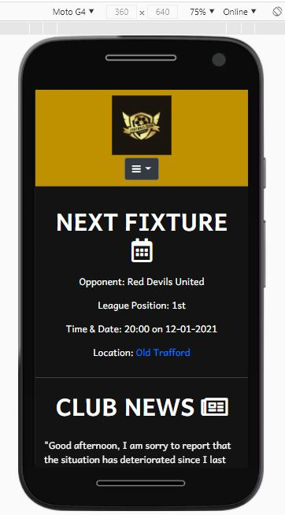  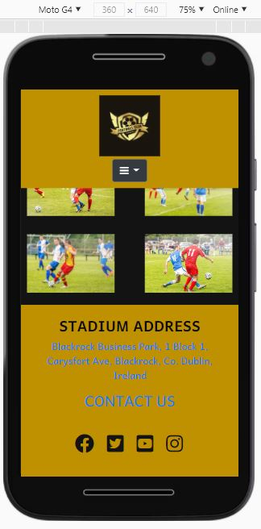

 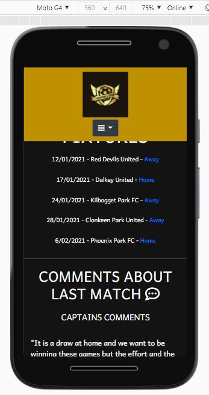

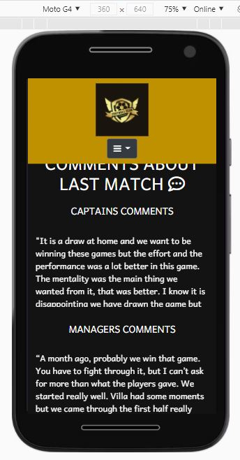 

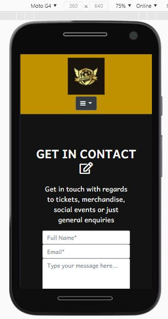 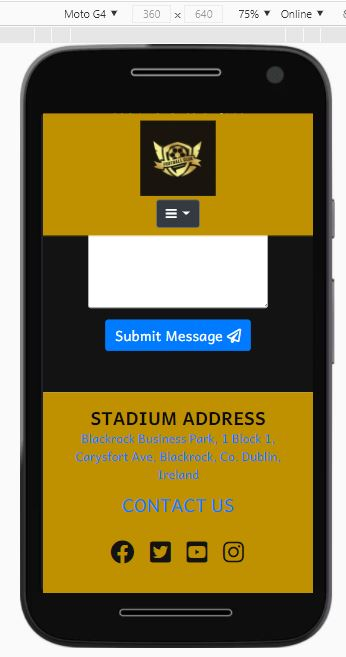

### Pixel 2

Screen size 411 x 731

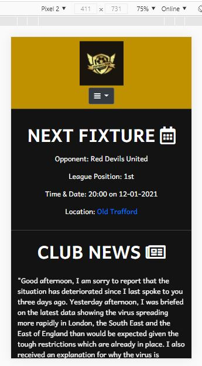 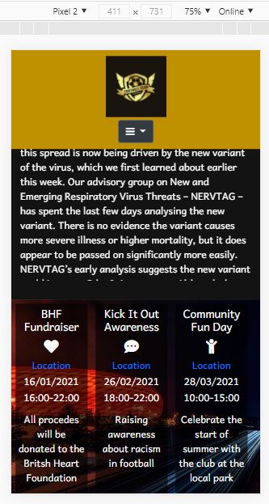

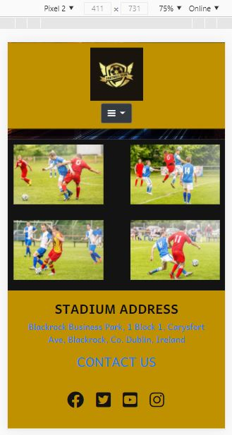 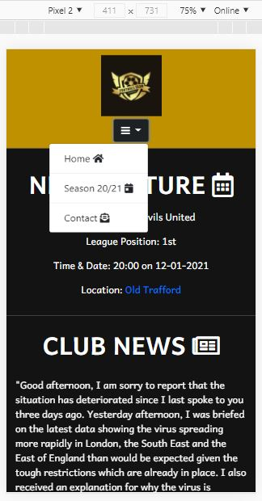

 

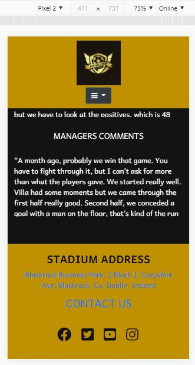 

  

  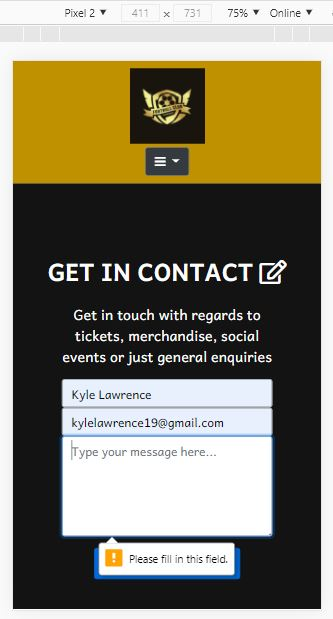

### Samsung Galaxy fold

Screen size 280 x 653

 

Whilst testing the responsiveness of my site i noticed that when the site was on a Galaxy fold the social-events section would push the content down causing two of the divs to stay on the same line whilst the third div went below the other two. The font was also to large and it was not fitting into each div properly.
I changed the width from 29% to 28% as well as changing the sizing of the font to fit look more appealing. Making sure your site looks good on all devices is important and with the chances of foldable phones becoming more popular it is important a site is ready for the potential demand.

# Test Cases

I checked to make sure all links worked and opened onto another page. I was able to see that I had not added the target=_blank to the links for the locations on the index.html page for the social events. The links opened in the same window.

 

All links for next 5 fixtures on the Season20/21 page open in a new window, and all Home matches go to the same location. All away games go to different locations. The links in the footer all open up in a new window and the stadium address in the footer opens up to the same address as the Home game links. The social-media icons all open to their respective sites in a new window. 

When you go to send a message on the contact page a warning comes up saying that you need to fill-in that specific section of the form.

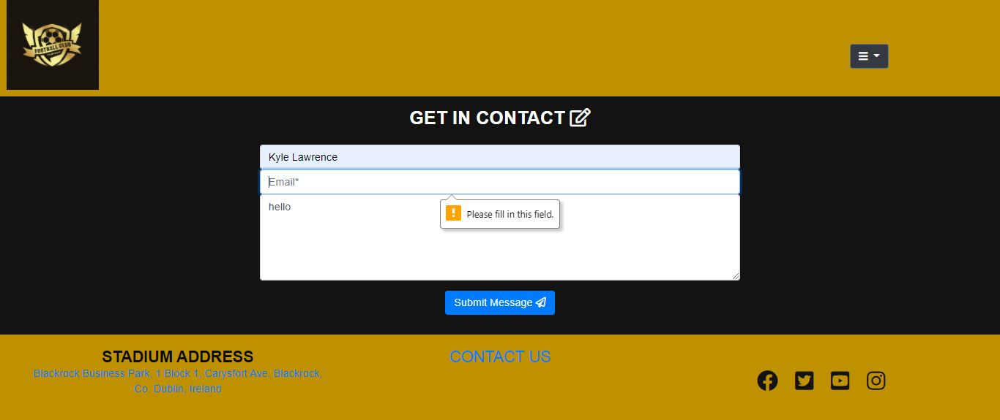

Making sure the warning shows is important because if the warning did not show this may lead to visitors becoming annoyed because they might not know what they are doing wrong. 

Another test was to make sure that when the clubs logo is clicked that the visitor is taken back to the home page and when tested on the contact form page I was taken back to the home page.